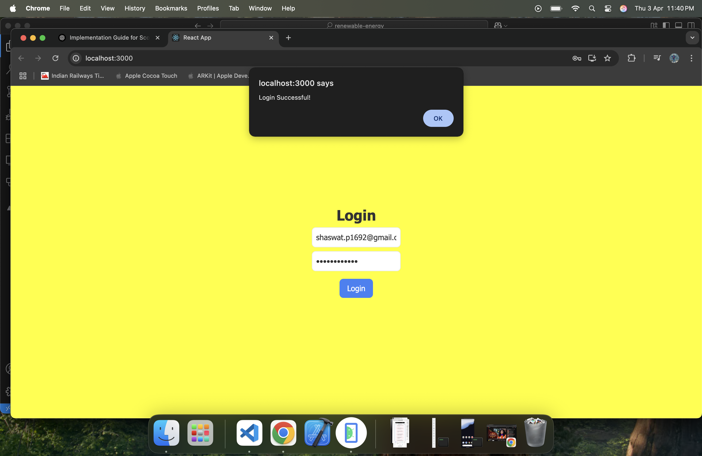
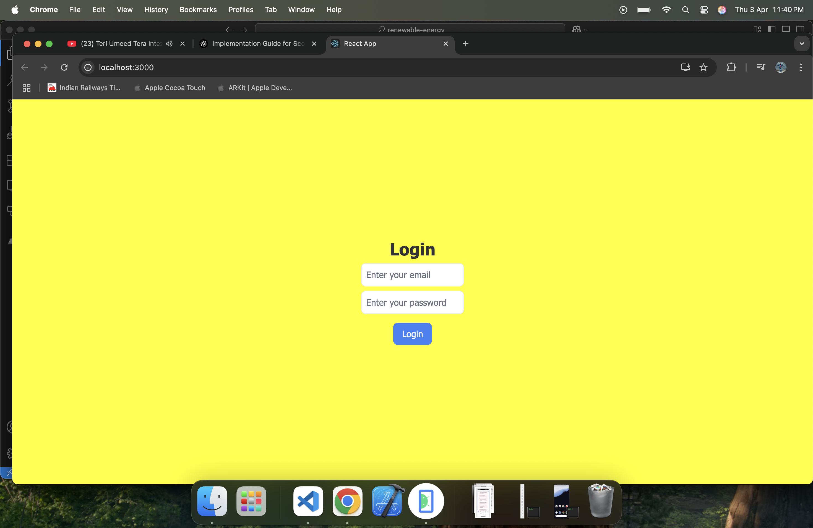
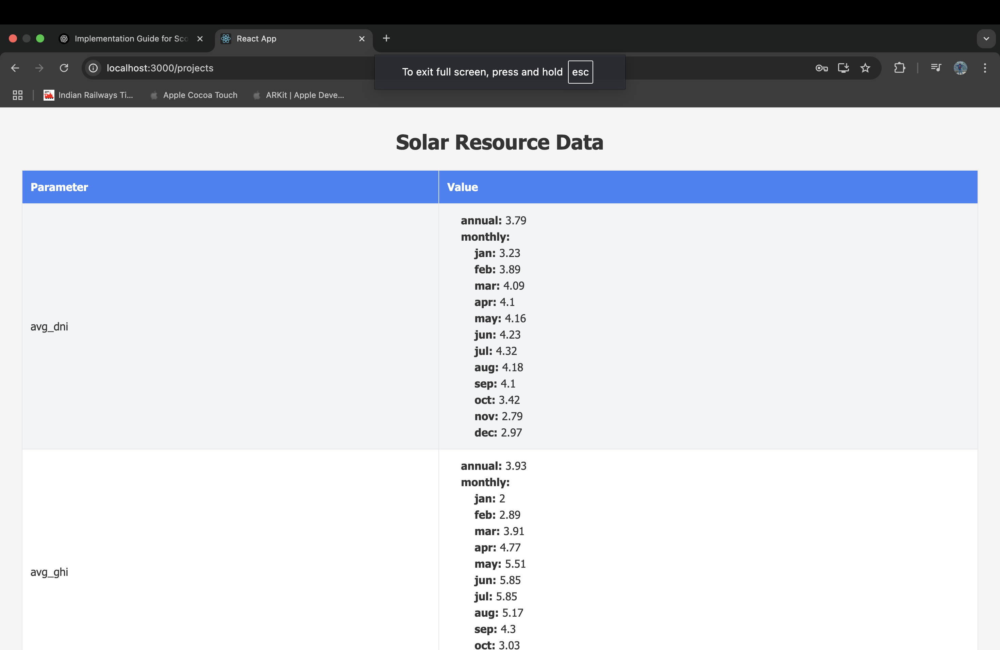
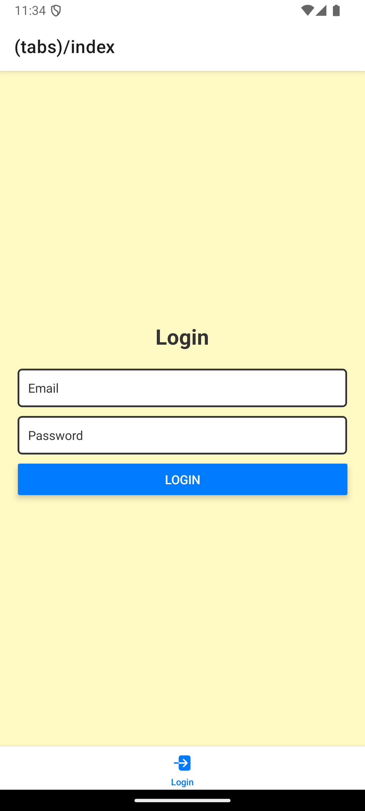
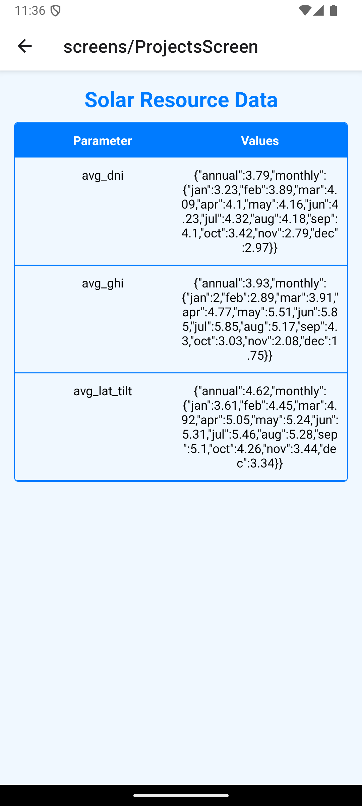

# 🌐 Mobile & Web App Project

### 🚀 **Overview**
This is a full-stack application consisting of:
- **Mobile App:** Developed with **React Native** using Expo.
- **Web App:** Built with **React.js** and Tailwind CSS.
- **Backend Services:** Firebase Authentication and Firestore.
- **State Management:** Context API.
- **API Handling:** Axios.
- **Local Storage:** AsyncStorage (Mobile) and LocalStorage (Web).
- **CI/CD:** GitHub Actions + Vercel for web deployment.

---


---

### 🔥 **💻 Tech Stack**
- **Frontend:** React.js (Web) & React Native (Mobile)
- **Backend:** Firebase (Authentication + Firestore)
- **API:** Axios for HTTP requests
- **State Management:** Context API
- **Styling:** Tailwind CSS (Web) & React Native Stylesheet (Mobile)
- **Local Storage:** AsyncStorage & LocalStorage
- **CI/CD:** GitHub Actions + Vercel
- **Deployment:** Vercel (Web), Expo Go (Mobile)

---

### 🚀 **🌟 Features**
✅ User Authentication (Login/Signup)  
✅ Secure Firestore Data Fetching  
✅ Cross-Platform Compatibility (Mobile & Web)  
✅ State Management with Context API  
✅ API Data Fetching with Axios  
✅ Local Storage & Caching  
✅ CI/CD Pipelines with GitHub Actions  
✅ Automated Web Deployment with Vercel  
✅ Mobile Deployment via Expo Go  

---

### 🔥 **📚 Installation Instructions**

✅ **1. Clone the repository**
```bash
git clone https://github.com/SHASWATprakash/renewable-energy


## 🌍 Web App Screenshot





## 📱 Mobile App Screenshot





## 🎥 Demo Video

📌 [Watch Full Demo on Google Drive](https://drive.google.com/drive/folders/16kJ6A2DbGLMGQCB2gQFNrj-VNSjmpgzr?usp=sharing)
